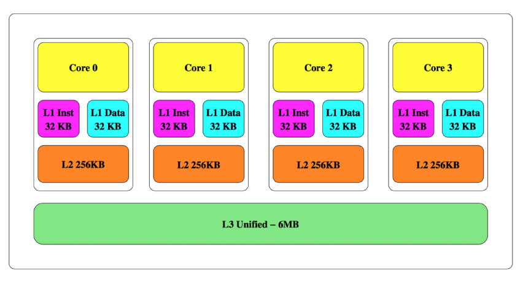
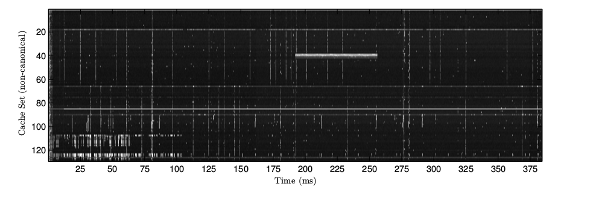
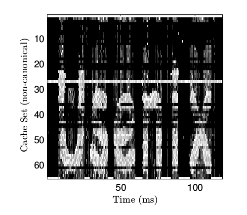
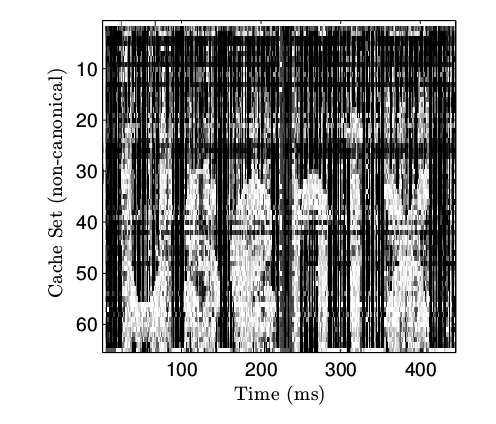
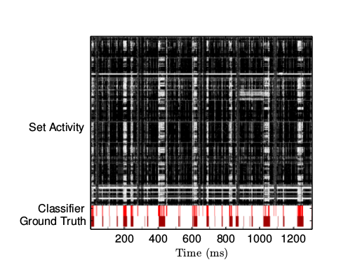
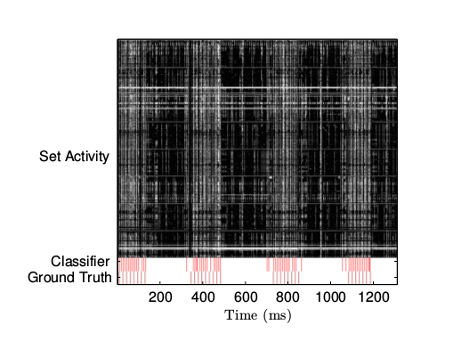

# 沙箱中的间谍 - 一种可行的JavaScript缓存攻击
------------------------

## 术语表
- Cache Memory 高速缓存
- last-level cache
- Cache set 缓存块（组）
- Cache line 缓存线
- cache miss 缓存未命中
- eviction 移除
- privilege ring 特权环
- page frame 页框
- side channel 旁路（边信道）
- eviction set 移除集
- cycle
- native language 
- PRIME + PROBE 装填和探测
- eviction buffer
- canonical 正规
- flow tracking

## 翻译参考
- http://baike.baidu.com/link?url=jQGLb4ZNHV9ReIvGyRJppN94pp-ztWK-qcN0vsNzJTeKy3Htl6YpDgguwRtP2OGHpwKoX0U0vpTvqD-tuYXWa_
- http://www.docin.com/p-692268752.html
- [freeshell修复边信道攻击漏洞](http://www.2cto.com/Article/201409/332354.html)
- [10] https://www.usenix.org/conference/woot14/workshop-program/presentation/ho
------------------------

## 摘要

本文将展示一种完全运行在浏览器里的针对微架构的旁路攻击方式。与这个领域里的其它攻击方式不同，这种方法不需要攻击者在受害者的电脑上安装任何
应用程序来展开攻击，受害者只需要打开一个被攻击者控制的不可信的网页。这种攻击模型可伸缩性很高，十分贴近现在的网络环境，绝大多数连接到Internet
的桌面浏览器都无法防御。这种攻击手段是Yarom等人【23】提出的last-level attak攻击的扩展，可以让身处远方的对手获得属于其它进程，其他用户甚至是
同一台宿主上的虚拟机的信息，只要它们和受害者的浏览器运行在一起。我们描述了这种攻击背后的基本原理，用一种高带宽的隐藏通道验证了它的性能，最后
用它构建了一种系统级别的鼠标和网络的活动记录器。抵御这种攻击使可能的，但是所需的反制措施将会对浏览器和电脑的正常使用产生不切实际的代价。


## 1 简介

边信号分析是密码学攻击里一种非常强大的类别。攻击者通过分析安全设备内部在进行安全运算时所产生的的物理信号（电流，辐射，热量等）来取得秘密信息。
据说在二战中便有情报部门在使用，并由Kocher等人在1996年[14]首次在学术环境下讨论。边信号分析被证实可以侵入无数的现实世界中的系统，从汽车报警器
到高安全性的密码协处理器[8][18]。缓存攻击是和个人电脑相关的一种边信号攻击，因为缓存区被不同的进程或者用户使用导致秘密信息的泄露[17][11]。

虽然旁路攻击的能效不容置疑，但是真正应用到实际的系统上是相对受限的。影响旁路攻击的一个主要问题因素是对**攻击模型**的假设：除了基于网络的
时序攻击，大部分的旁路攻击都要求攻击者非常接近受害者。对缓存攻击而言，一般会假设能够在受害者的机器上执行任意的二进制的代码。虽然这个假设
适用于像 Amazon 云计算平台这样的 IaaS 或者 PaaS 环境，但是对于其它设置而言就不是那么相关了。

在这篇报告里，我们用一种约束更少、更可行的攻击者模型挑战了这一限制性的安全假设。在这个模型里，受害者只需要**访问一个网页**，这个网页
由攻击者所拥有。我们会展示即使在这么简单的攻击者模型里，攻击者依然能够在可行的时间长度里，从被攻击的系统中提取出有意义的信息。为了和这样的
计算设定保持一致，我们把注意力集中在了**跟踪用户行为**而不是获取密匙上。报告中的攻击方式因为这些原因是高度可行的：对于攻击者的假设和限定是
实际的；运行的时间是实际的；对攻击者带来的好处也是实际的。据我们掌握的知识，这是首个可以轻松扩展至上百万个目标的旁路攻击方式。

我们假设攻击中受害者使用的个人电脑配备有比较新的 Intel CPU 信号，并进一步假设用户用支持 HTML5 的浏览器访问网页。见章节 5.1 ，这覆盖了
绝大部分连接到 Internet 的个人电脑。用户被强迫访问页面，这个页面上有一个由攻击者控制的元素比如广告。攻击代码会自动执行基于JavaScript的
缓存攻击（详见章节2），可以持续地访问被攻击系统的 last-level cache (LLC) 。因为所有的CPU内核，用户，进程，保护令牌等共享同一个缓存，所以
可以为攻击者提供用户和被攻击系统的详细信息。
 
### 1.1 现代 Intel CPU 的内存架构
 
现代的计算机系统通常会采用一个高速的中央处理器和一个容量大但是速度较慢的随机存取器。为了桥接这两个模块的性能差异，现代的计算机系统会采用
高速缓存 - 一种容量容量小的多但是速度更快的内存元素，着里面保存了 RAM 中最近被 CPU 访问过的子集。高速缓存通常会采用分层设计，在 CPU 和 RAM 
之间分层放置一些列更大和更慢的缓存元素。图1取自[22]，展示了 Intel Ivy Bridge 的缓存结构，包括，较小的 level 1(L1) cache，大一些的
level 2 (L2) cache，最后是最大的 level 3 (L3) cache 并和 RAM 相连。Intel 当前代号为 Haswell 的新一代 CPU 采用了另一种嵌入式的 
DRAM(eDRAM) 设计，不在讨论范围内。如果 CPU 需要访问的数据当前不在缓存里，会触发一个 **cache miss** ，为了给新元素腾出空间，当前缓存
里的一项必须被 **evicted**。


  
Intel 的缓存微架构是**嵌套的**-所有一级缓存里的数据必须同时存在二级和三级缓存里。反过来的，如果某个元素在三级缓存里被移除，那它也会立刻被
从二级和一级缓存里移走。需要注意的是 AMD 缓存微架构的设计是专一的，所以本文描述的方法并不能立刻应用到该平台上。
  
本文重点关注的是三级缓存，通常也被称为 last-level cache (LLC)。由于 LLC 较大，CPU 访问内存的时候如果把整个LLC的内容都搜索一遍效率会很低。
为了避免这个问题，LLC 通常被分成不同的**缓存组**，每一组都对应者内存空间的一个固定的子集。每个组包含若干缓存线。比如 Haswell 系列中的 
Intel Core i7-3720QM 处理器拥有 8192 = 2^13 个组，每个组有 12 条 64 = 2^6 字节的缓存线，共同组成 8192x12x64 = 6 MB的高速缓存。
CPU 如果要检查一个给定的物理地址是否在三级缓存里，会首先计算出组，然后只检查组内的缓存线。结果就是，某个物理地址的缓存未命中，会导致共享
同一个组的少量缓存线中的一条被移除，这个事实会被我们的攻击大量运用。由64比特的物理地址到13比特的组索引的映射方法已经被 Hund 等人在
2013年逆向工程出来。在表示物理地址的64个bit里，5到0被忽略，16到6被直接用来作为快索引的低11位，63到17被散列来生成组索引的高两位。LLC 被
不同的内核、线程、进程、用户，乃至运行在一块 CPU 芯片上的虚拟机所共享，而不论特权环或其它类似的保护措施。

现代的个人电脑用一种虚拟内存机制，在这种机制里用户的进程一般没办法直接知道和访问系统的物理内存。取而代之的是，进程会被分配不同的虚拟内存页。
如果某页被当前执行的进程访问，操作系统会在物理内存里动态地分配一个页框。CPU的内存管理单元(MMU)负责把不同进程对虚拟内存地址的访问映射到实际的
物理内存。Intel 处理器的页和页框大小一般是4KB，页和页框的是按照页对齐的-每页的开始地址是页大小的倍数。这意味着，任何虚拟地址的低12位和对应
的虚拟地址是一一对应的，这一事实也在我们的攻击中用到。

### 1.2 缓存攻击

缓存攻击是针对微架构的攻击手段中一个典型的代表， Aciiamez 在他的出色的调查中定义为 “利用信任架构边际下方的处理器底层结构”从不同的安全系统中
获取秘密信息。 缓存攻击基于这样的事实：尽管在上层有像沙箱、虚拟内存、特权环，宿主这样的安全机制，安全和不安全的进程公用缓存。这使得“间谍”进程
通过公用的缓存来测量和干扰其它安全进程的内部状态。Hu 在1992年的首次发现及随后的一些结果显示了旁路攻击可被用来活取 AES / RSA 的密匙，甚至可以
允许虚拟机侵入宿主上的其它机器。

我们的攻击模型建立在 装填+探测 的基础上，这个方法由 Osvik 在[17]中首次描述，不过那时是针对一级缓存的。之后由 Yarom 等人在[23]中扩展到启用了
较大内存页系统的 last-level cache。我们把这种方法扩展了一下，支持更加常见的4K的页大小。总的来说，缓存攻击有四个步骤。第一步，攻击者建立一个
或多个**移除集**。移除集是内存中的一系列地址，地址被访问的时候会接管受害者进程使用的一条缓存线。第二步，攻击者通过访问移除集填充整个缓存块。
这会使得受害者的代码或指令被从组中移除，并使其进入一个已知的状态。第三步，攻击者触发或等待受害者执行和使用组。最后，攻击者通过再次
访问移除集**探测**组。如果访问的延迟比较低，意味着攻击者的指令或数据还在缓存里。另一方面，较高的访问延迟意味着受害者的代码用到了组。
实际的时间测量是用非特权的汇编指令`RDTSC`进行的，这个指令可以得到处理器非常准确的cycle次数。再次遍历链表还有第二个目的就是强制组进入
被攻击者控制的状态，为下一轮的测量做好准备。

### 1.3 Web 运行环境

JavaScript 是一种拥有动态类型，基于对象的脚本语言，运行时计算使浏览器端很强大。JavaScript 代码以源码的形式传到浏览器端，由浏览器即时编译
的机制来编译和优化。不同浏览器厂商之间的激烈竞争使不断改进 JavaScrip 性能备受关注。结果就是，在某些场景下， JavaScript 执行的效率已经
可以和本地代码相媲美。

JavaScript 的核心功能是由 ECMA 产业协会在 ECMA-262 标准中定义的。该标准由万维网协会定义的一系应用程序编程接口(API)所补充，因此非常
适合开发 Web 内容。JavaScript API的集合是不断演进的，浏览器厂商依照自己的开发计划不断增加啊新的API支持。我们的成果里用到两个具体的API:
第一个是类型数组，允许高效地访问非结构化的二进制数组。第二个是高精度的时间API，允许应用程序进行毫秒一下的时间测量。如章节5.1所示，当今主流
的浏览器同时支持这两个API。

JavaScript代码运行在高度隔离的环境里 - 用 JavaScript 交付的代码访问系统非常受限。例如，JavaScript代码如果没有用户的允许不能打开文件，
哪怕只是读取。JavaScript代码不能执行本地语言的代码或者加载本地的代码库。最重要的是，JavaScript没有指针的概念，所以你甚至都无法知道一个
JavaScript 变量的虚拟地址。
 
### 1.4 我们的工作

我们的目的是构造一个可以通过 Web 发动的 last-level cache 攻击。这个过程是充满挑战的，因为JavaScript代码没法加载共享的库或者执行本机语言
的程序，并且由于无法直接调用专用的汇编指令而被迫调用脚本语言进行时间的测量。尽管有这些挑战，我盟还是成功地把缓存攻击扩展到了基于Web的环境：

- 我们介绍了一种用在last-level cache 上的**非常规移除集**方法。与[23]不同，我们的方法不要求系统配置成提供较大的页支持，所以能够很快的
应用到诸多的桌面和服务器系统。我们展示了该方法虽然是使用 JavaScript 实现的，但是依然可以在实际的时间里完成。

- 我们展示了一种**完全可用的利用非特权JavaScript 发动 last-level cache 攻击**的方法。我们用隐藏通道的方式，评估了它的性能，包括同一个
机器上的不同进程和相同宿主上的不同虚拟机客户端。基于 JavaScript 的通道与[23]中用机器语言实现的方法类似，都可以达到美妙几百kb的速度。

- 我们展示了怎么利用基于 cache 的方法来有效地跟踪用户的行为。缓存攻击的这一应用与我们的攻击模型更相关，而不是和其它研究里的密码学应用。

- 最后，我盟描述了应对此类攻击的**反制措施**和它们的系统级代价。

文档结构：
第二章，攻击方法不同阶段的设计与实现
第三章，基于攻击方法建立起来的隐藏通道，这个通道也被用来验证方法的性能
第四章，缓存攻击如何被用来跟踪用户在浏览器内外的行为
第五章，总结，反制措施和仍未解决的研究挑战

## 2 攻击方法

正如前文所诉，一次成功的 装填+探测 攻击包含几个步骤：为一个或多个组建立移除集，填充组，触发受害者的操作，最后再次填充组。
虽然装填和探测实现起来很简单，但是要找到对应与某个系统操作的组并且为它建立移除集就不那么容易了。在本章里，我们描述了这几个步骤用 
JavaScript 如何实现。

### 2.1 建立一个移除集

### 2.1.1 设计

正如[23]写到，装填+探测 攻击的第一步是替被攻击的进程所共享的组建立一个移除集。这个移除集包含一系列的变量，这些变量被 CPU 映射到相同的
组里。参考文[20]的建议，使用链表是为了避免 CPU 的内存预读和流水线优化。我们显展示了怎么为任意一个组建立一个移除集，然后解决了如何
找到与受害者共享的内存块的问题。

文章[17]指出，一级缓存是依据虚拟地址的低位的比特来决定组的分配的。假设攻击者知道变量的虚拟地址，在一级缓存的攻击模型里建立移除集很容易。
另一方面，LLC里变量的组分配是依照物理内存的地址进行的，而且一半的非特权进程无法知道分配过程。文[23]的作者为了绕开这个问题，假设系统用
较大的页模型，在这个模型里，物理地址和虚拟地址的低21位是相同的，并且用迭代的算法来获得高位的组的索引。

在我们所考虑的攻击模型里，系统运行在4K的页模型下，物理地址和虚拟地址只有最低的12位是相同的。雪上加霜的是，JavaScript没有指针的概念，所以
自己定义的变量的虚拟地址也是不知道的。

从64位物理地址到13位的组索引的映射被Hund等人研究过。他们发现，访问物理内存里一段连续的、8MB大小的“eviction buffer”会让三级缓存里的所有组
都失效。虽然我们没有办法在用户态下分配这样的一个 evition buffer （实际上，文章[12]是通过内核模式的驱动达成的），我们用 JavaScript在
虚拟内存里分配了一个8MB大小的数组（实际是由系统分配的随机、不连续的4K物理内存页的集合），然后测量迭代这个缓存在系统范围内的影响。
我们发现在迭代访问了这个 eviction buffer 后如果立即访问内存中其它不相关的变量，访问的延迟会显著的增加。
另外一个发现是，即使不访问整个缓冲区而是每隔64字节去访问，这个现象依然存在。但是，我们所访问的131K个偏移值到8192个可能的组的映射关系
并没有立刻清晰起来，因为我们不知道我们的缓冲区里各个页在物理内存中的地址。


解决这个问题一个不成熟的做法是，给定一个任意的“受害者”在内存中的地址，通过暴力手段从131K个偏移中找到12个与这个地址共享组的地址。要完成这点，
我们可以从131K个偏移量固定几个作为子集，然后在迭代了所有的偏移量后测量下访问的延迟有没有变化。如果延迟增加了，意味着集合里包含着12个与
受害者地址共享组。如果延迟没有变化，那子集里不包括12个地址中的任何一个，这样受害者地址就还在缓存里。把这个过程重复8192遍，每次用一个不同的
受害者地址，我们就可以识别每个组并且建立自己的数据结构。

受这个启发立刻写出来的程序会运行时间会非常长。幸运的是， Intel MMU 的页帧大小（章节1.1）非常有帮助，因为虚拟地址是页对齐的，每个虚拟地址的
低12位和每个物理的低12位是一致的。据 Hund 等人所称，12个比特中的6个被用来唯一决定组索引。因此，eviction buffer 中的一个偏移会和其它8K偏移
共享12到6位，而不是所有131K个。而且，只要找到一个组就能立刻知道其它的63个在相同页帧里的组。再加上JavaScript分配大的数据缓冲区的时候是
和页帧的边界对其的，所以可以用算法1中的贪心算法。

**Algorithm 1** Profiling a cache set
Let S be the set of unmapped pages, and address x be an arbitrary page-aligned address in memory

1. Repeat k times:

```
(a) Iteratively access all members of S
(b) Measure t 1 , the time it takes to access x
(c) Select a random page s from S and remove it
(d) Iteratively access all members of S\s
(e) Measure t 2 , the time it takes to access x
(f) If removing page s caused the memory access to speed up considerably (i.e., t 1 − t 2 > thres),
then this page is part of the same set as x. Place it back into S.
(g) If removing page s did not cause memory access to speed up considerably,
then this address is not part of the same set as x.
```
2. If |S| = 12, return S. Otherwise report failure.

多次运行这个程序，我们可以逐渐的建立一个 eviction set 来覆盖大部分的缓存，除了那些被 JavaScript 本身运行所使用的。我们注意到，
与[23]中的算法建立的 eviction buffer 不同，我们的 eviction set 不是正统的 - 因为JavaScript 没有指针的概念，所以如果我们发现了一个
eviction set 我们没有办法知道它对应着 CPU 高速缓存的哪个组。此外，在相同的机器上每次运行这个算法都会得到不同的映射。这也许是源于4K的页大小
而不是2MB的页大小，即使不用JavaScript用机器码也无法改变。

### 2.1.2 验证

我们用 JavaScript 实现了 算法1 并且在安装了 Ivy Bridge， Sandy Bridge，Haswell系列 CPU 的机器上进行验证，机器上装有 Safari 和 Firefox
对应运行在 Mac OS Yosemite 和 Ubuntu 14.04 LTS 操作系统上。系统并没有被配置使用大的页而是用默认的 4K 页大小。列表1显示了实现 算法1.d
和 算法1.e 的代码，演示了JavaScript下怎么遍历链表和测量时间。算法的运行在 Chrome 和 Internet Explorer 下依赖的额外的几个步骤在章节5.1中。

```javascript
// Invalidate the cache set
var currentEntry = startAddress;
do {
    currentEntry = probeView.getUint32(currentEntry);
} while (currentEntry != startAddress);

// Measure access time
var startTime = window.performance.now();
currentEntry = primeView.getUint32(variableToAccess);

var endTime = window.performance.now();
```
算法1

图2显示了 profiling algorithm 的性能，使用 Intel i7-3720QM， 装有 Firefox 35.0.1 和 Mac OS 10.10.2 。我们很高兴的发现在30秒内就
映射了超过25%的组，1分钟内就达到了50%。这个算法并行是非常简单的，因为大部分的执行时间花在了维护数据结构上，只有一小部分实际花在让缓存失效和
度量上。整个算法不到500行JavaScript代码。

为了验证我们的算法能够辨别不同的组，我们设计yin了一个实验来比较一个变量被flush前后的访问延迟。图3显示了两种方式访问变量的概率分布函数。灰色的是
用我们的方式从缓存中flush出去的，黑色是贮存在缓存里的。时间的测量是用JavaScript的高精度计时器，因此也包括了JavaScript运行时的延迟。
两者的不同是显而易见的。图4显示的是在每个组有16个条目的较早版本的 Sandy Bridge CPU 上捕捉到的结果。我们把这种视觉呈现称作 “内存谱图”，
因为它看起来很像声音的谱图。



图5显示的是每隔400ms抓取一次的内存谱图。其中X轴对应时间，Y轴对应不同的组。例子中的时间分辨率是250微秒，检测了一共128块个组。每个点的密度
代表了这个组在这个时间的访问延迟。黑色代表延迟较低，意味从上次测量到现在没有其它进程访问过这个组。白色意味着攻击者的数据在上次测量之后被清除了。

细看这个内存谱图可以得到几个显而易见的事实。首先，很明显虽然没用机器语言指令而是用了 JavaScript 的计时器，测量的抖动很小，活跃和不活跃的组
很容易被区分。很容易注意到图中有几条垂直的线，意味着同一时间间隔里有多个相邻的组被访问。因为连续的组对应的物理内存的地址也是连续的，我们
相信这个信号代表着一个超过 64 字节的汇编指令。还有一些聚在一起的组被同时访问。我们推理这代表着变量的访问。最后，横着的白线预示着一个变量
被不断地访问。这个变量可能是属于测量代码的或是当前的 JavaScript 运行时。从一个没有任何特权的网页能得到这么多信息真是太了不起了。

### 2.2 在缓存里找有意思的区域

清除集让黑客能够监控任意一个缓存里的组的动作。因为我们得到的清除集是不典型的，因此攻击者必须想办法把测量的组和受害者的数据或是代码的地址
关联起来。这个学习/分类的问题已经由 Zhang 和 Yarom 分别在 文[25] 和 文[23] 里提出了，他们采用了不同的例如 SVM 的机器学习的算法试图从
缓存延迟的测量数据里找到规律。

为了有效地展开这个学习的过程，攻击需要诱导受害者做一些操作，然后检查哪些组被这个操作访问到，详见 算法2。

```
Let S i be the data structure matched to eviction set i
1. For each set i:
    (a) Iteratively access all members of S i to prime the cache set
    (b) Measure the time it takes to iteratively access all members of S i
    (c) Perform an interesting operation
    (d) Measure once more the time it takes to iteratively access all members of S i
    (e) If performing the interesting operation caused the access time to slow down considerably, then the operation was 
    associated with cache set i.
```

因为JavaScript受到一系列的权限限制，实现步骤(c)是很有挑战的。与之形成对比的是 Apecechea等人能够用一个空的**sysenter**调用来触发一次
细小的内核操作。为了实现这个步骤，我们必须调查 JavaScript 的运行时来发现哪些函数会触发有意思的行为，例如文件访问，网络访问，内存分配等等。
我们还对那些运行时间相对较短，不会产生遗留的函数感兴趣。遗留可能导致垃圾回收，进而影响步骤(d)的测量。Ho 等人在 文[10] 中已经找到了这样的
几个函数。另外一种方式是诱导用户代替攻击者执行一个特定的操作（比如在键盘上按一个键）。这个例子里的学习过程可能是结构化的（攻击者知道受害者
将要执行的时机），也可能是非结构化的（攻击者只能假设系统一段时间内的响应缓慢是由受害者的操作导致的）。这两种方法都被使用，详见章节4。

因为我们的代码会一直检测到JavaScript运行时的活动，高性能的计时器的代码和浏览器其它模块的代码，实际上我们调用两个相似的函数并检查它们
两次活动剖析的**对比**，以此来寻找相关的组。

## 3 JavaScript实现的基于高速缓冲区的隐藏信道

### 3.1 动机

正如 文23 展示的，LLC 访问的方式可被用来建立一个高带宽的隐藏信道并用来在同一台宿主上的两个虚拟机之间渗透敏感的信息。在我们的攻击模型里，
攻击者不在同一台宿主上的虚拟机里而是在一个网页里，隐藏信道的动机虽然不一样但是也很有趣。

经由我们的动机，假设一家安全机构在追踪犯罪大师Bob。通过钓鱼项目，机构在 Bob 的个人电脑上装了一个被称作 Advanced Persistent Threat 的
软件。APT被设计用来记录 Bob 的犯罪记录并发送到机构的秘密服务器上。然而 Bob 非常的警觉，他使用了启用了强制 Information Flow Tracking
的操作系统。操作系统的这个功能阻止了 APT 在访问了可能含有隐私用户数据的文件后连上网络。

这个机构可以立刻采用基于 JavaScript 的高速缓冲区攻击，只要 Bob 能被诱导访问一个由机构的控制的网页。APT可以利用高速缓冲区的边信道和恶意网站
通信，这样不会通过网络传输用户的隐私数据，而且不会触发操作系统的 flow tracking 功能。

这个案例受到了 “RF retro-reflector” ，这个设计归属于一家安全机构，在这个设计里一台像是麦克风的收集器并不会把接收到的信号直接发送出去，
而是转换到由一个外部”收集设备“发送给它的“照射信号”上去。
 
### 3.1.1 设计

我们隐藏信道的设计受到两个需求的影响：第一，保持发送端的简单，尤其是我们不想让它执行 章节2.1 中的清楚集算法。第二，因为接收端的移除集是非
正规的，它应该足够简单，这样接受者就可以搜索到发送端转换信号到了哪一个组。

为了满足这些需求，我们的发射器/ APT 在自己的内存中分配了4K的数组，并且不断地把收集到的数据转换成这个数组被访问内存的模式。这个4K的数组
覆盖了64个组，这样APT在每个时间周期里就能传送64比特的数据。为了能保证内存的访问能够被接收端定位到，相同的访问模式被重复运用到数组的几个
拷贝上。 因此缓存中很可观的一部分都会被执行到，文[23] 中的方法使用的是正规的移除集，因此只会激活两条线。

接收端的代码会为操作系统的内存做一个剖面，然后搜索含有被APT转换过的数据的 page frame。这个数据会被从内存访问的模式里解码出来然后传回数据库，
始终都不会违背操作系统对flow tracking 的保护。

### 3.1.2 验证

我们的攻击模型假设发送端使用（相对较快的）机器语言邪恶，而接收端是用JavaScript写的。因此，我们假设系统的限制性因素是恶意网站的
采样速度。

为了验证隐藏信道的带宽，我们写了一个小程序用预先设定好的模式来遍历系统的内存（例子会用到含有单词"Usenix"的比特图）。
然后，我们试图用JavaScript高速缓存攻击来寻找这一访问模式，之后测量JavaScript代码所能达到的最大的频率。



图6 显示的内存谱图捕捉到了这一隐藏信道。隐藏信道名义上的带宽通过测量大约是320kbps，而文[23]中用机器码得到的跨虚拟机隐藏信道
的带块大概是1.2Mbps，足以相提并论。



图7 中相似的内存谱图并非由运行在主机上的接收端代码得到的，而是在一台虚拟机上得到的（Firefox 34浏览器，Ubuntu 14.01 系统，
VMWare Fusion 7.1.0 宿主）。尽管在这个场景下高峰频率只能到大约 8kbps，但是虚拟机中的网页能够探测到底层硬件，这着实让人惊讶。

## 4 利用高速缓存攻击跟踪用户行为

绝大多数关于高速缓存攻击的研究都假设攻击者和受害者位于同一家云供应商的数据中心。这样的机器一般不会配置成接收交互式的输入，
所以该领域的大部分研究都聚焦于如何获得加密钥匙或其它保密的状态元素，譬如随机数生成器的状态[26]。 本文将研究怎么利用高速缓冲区
攻击来跟踪用户的行为。我们注意到[20]已经尝试基于一级缓存对系统负载进行细粒度的度量，以此跟踪按键时间的事件。

本案例研究了恶意网站怎么用高速缓冲区跟踪用户的活动。在接下来即将展示的的攻击里，我们假设用户在一个背景标签页或窗口里加载
了一个恶意网页，并且在另一个标签或是另外一个完全没有互联网连接的应用里执行了敏感的操作。

我们选择了把焦点集中在鼠标操作和网络活动上，因为处理它们的系统代码没法忽略不计。因此，我们推测这些操作会有相对较大的缓存脚印。
正如下文所述，它们也很容易被JavaScript受限的安全模型所触发。

### 4.1 设计

两种攻击的结构是类似的。首先，是剖析过程，攻击者可用JavaScript探测某一个组。接着，在训练阶段，待检测的活动被触发，伴随着
对高速缓存区的高精度采样。一边是用测量脚本直接触发网络活动（通过执行一个网络请求），一边是在训练阶段不停的摇晃鼠标。

通过比较高速缓冲区在训练阶段闲时和忙时的活动，攻击者了解到相关的活动会唯一激活那部分的组，并且训练出一个组的分类器。最后，
在分类阶段，攻击者不断地监控相关组。

我们用一个基本的非结构化的训练过程，假设训练过程中系统进行的最集中的操作就是被测量的。为了利用这点，我们计算了随着时间的
每次测量的 Hamming 权重（等于在某个周期内活跃组的个数），之后应用 k-meas 算法把测量数据做聚类。
然后计算每个簇中每个组的访问延迟，最终得到每个簇的中心。遇到未知的测量矢量，我们会计算这个矢量和各个中心的 Euclidean 距离，
并把它归到最近的那一类。

在分类阶段，我们用命令行工具 wget 生成网络流量，并且将鼠标移动到窗口以外。为了获得网络活动的真实数据，我们同时用 tcp-dump 
来测量系统的流量，然后用`tcp-dump`记录的时间戳映射到分类器所检测到时间。为了获得鼠标操作的真实数据，我们写了一个页面记录所有
鼠标事件的时间戳。需要强调的是记录鼠标活动的页面不在测量代码的浏览器（Firefox），而是运行在另一个浏览器里（Chrome）。

### 4.2 验证




活动测量的结果在 图8 和 图9 中显示了。两个图片的顶端显示了高速缓存子集的事实活动。图片的底端是分类器的输出结果，一起显示的
还有外部收集的真实数据。正如图片展示的那样，我们及其简单的分类器在识别鼠标操作和网络活动方面非常有效。毫无疑问，使用更加
高级的训练和分类技巧可以进一步提高攻击的效果。需要强调的是，鼠标操作的检测器并不会检测网络活动，反之亦然。

分类器的测量频率只有500Hz。结果就是，它没有办法统计单个的包而是在一个阶段里活跃还是不活跃。另一方面，检测鼠标活动的代码比
基本数据采集到的事件更多。这是因为Chrome 浏览器对鼠标事件的频率限制到了大约60Hz。

监测网络活动可以作为深度挖掘用户行为的基础，正如 Chen 等人在一篇著名的文章[5]中描述的。虽然 Chen 等人假设网络层的攻击者可以
监控受害者所有流入和流出的数据，但是这里所展示的技术本质上可以让恶意网站监控用户同时进行的网络操作。这个攻击可以被更多的指标
增强，例如内存分配（见文[13]），DOM布局事件，磁盘读写等。

## 5 结论

在这篇论文里，我们演示了在微处理器架构上如何发动边信道攻击，此类攻击已被认为是非常有效的，并且可以被不可信的网页有效地发动。
与缓存攻击一般被用于密码分析应用不同，本文介绍了这种方式如何被有效地利用来跟踪用户的行为。边信道攻击的范围已经被拓展了，
这意味着必须设计新一类的安全系统应对边信道攻击。

## 致谢 参考

见原文

